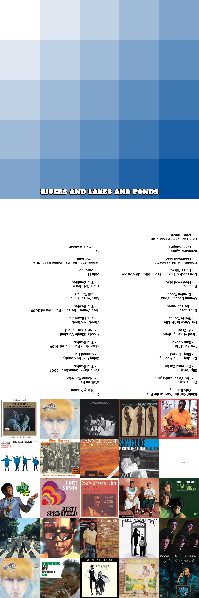

# Spotify Playlist CD Art Generator

This personal project generates a custom CD sleeve image for a Spotify playlist. The sleeve includes a minimalistic pixelated gradient background, the playlist title, a list of tracks in two columns, and a collage of album covers.

## Features

- Fetch playlist information from Spotify
- Create a pixelated gradient background
- Overlay the playlist title on the gradient background with a black border around white text
- Generate a two-column tracklist image with the author below the song title
- Create a collage of album covers from the playlist for back cover
- Combine the gradient, tracklist, and collage into a final CD sleeve image

## Requirements

- Python 3.x
- `spotipy` library
- `Pillow` library
- Spotify API credentials

## Setup

1. Clone the repository
2. Install the required libraries
3. Set up your Spotify API credentials

## Usage 

1. Run the script from the cd-art-creator.py file
2. Follow the prompts to input:
- The Spotify link to your playlist
- The starting and ending colors for the gradient background (as RGB values)
3. The script will generate the following images:
- `gradient.png`: The gradient background
- `gradient_with_text.png`: The gradient background with the playlist title overlaid
- `tracklist.png`: The two-column tracklist image
- `collage.png`: The collage of album covers
- `cd_sleeve_art.png`: The final CD sleeve image combining all elements

Note: The tracklist is intentionally flipped upside down in `cd_sleeve_art.png` since it's meant to be folded behind the title `gradient_with_text.png` as the inside sleeve.

## Example Output
- Here's an example image generated from the inputs below:
- Spotify playlist: https://open.spotify.com/playlist/3XVb3rK5NuwVD1RxsM2XVS?si=fea328b212f1479e
- RGB 1: 255, 255, 255 (White)
- RGB 2: 0, 76, 153 (Dark Blue)

## Acknowledgements

- Spotipy - A lightweight Python library for the Spotify Web API
- Pillow - The Python Imaging Library
- Special thanks to my dad for leaving unburnt cd's in our garage since the 90s